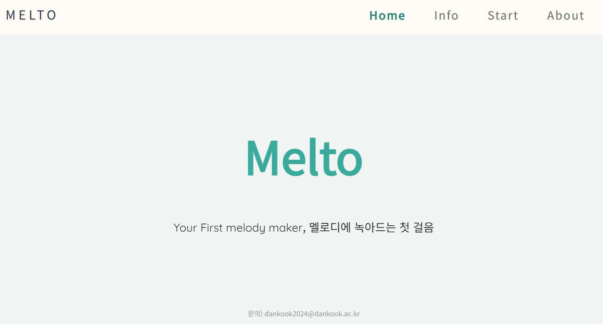
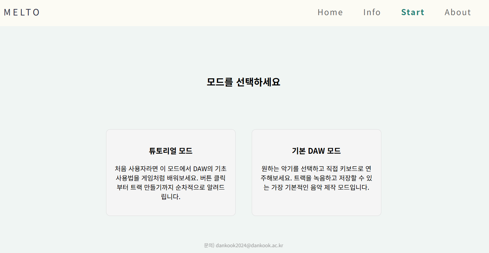
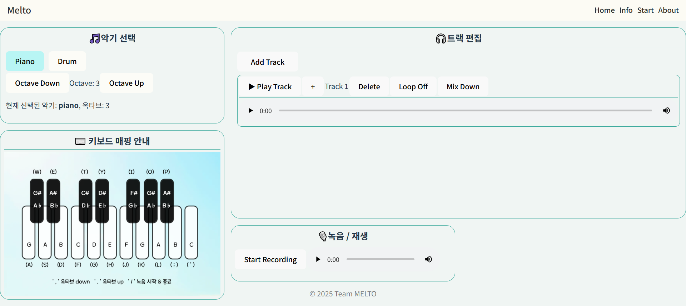

# Melto

Melto는 melting melody를 의미하며, 디지털 오디오 워크스테이션(DAW)에 익숙하지 않은 초보자도 음악 제작을 쉽고 재미있게 경험할 수 있도록 설계된 웹사이트입니다.
 
간단한 인터페이스와 튜토리얼을 통해 누구나 쉽게 자신의 멜로디를 만들어볼 수 있습니다.

접속 주소 : https://heeouo.github.io/open-daw-melto/index.html
 
 

### 개발자

### 프레임워크

### 사용된 핵심 오픈소스

### 프로젝트 소개

메인화면 우측 상단에서 "Home", "Info", "Start", "About" 메뉴를 확인하세요.
 
 

"Start" 메뉴를 클릭하여 튜토리얼 모드 또는 기본 DAW 기능 중 원하는 모드를 선택하세요.
 
 

키보드로 악기를 연주하고, 원하는 연주를 녹음하여 트랙에 추가하세요.
 
완성한 음악은 다운로드하여 개인 컴퓨터에서 자유롭게 감상하실 수 있습니다.
 